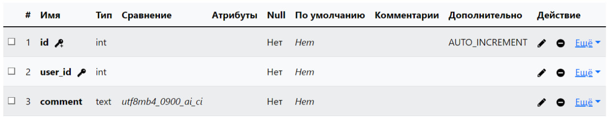
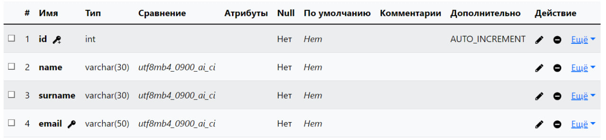

# Лабораторная работа № 9

### Создайте базу данных `blog` и создайте две таблицы `users` и `comments` с помощью языка `DDL (CREATE TABLE)`.

## Структура таблицы users:  
1. id (integer) — primary key
2. name
3. surname
4. email — unique key

 
```sql
CREATE TABLE `comments` (
  `id` int NOT NULL,
  `user_id` int NOT NULL,
  `comment` text NOT NULL
) ENGINE=InnoDB DEFAULT CHARSET=utf8mb4 COLLATE=utf8mb4_0900_ai_ci;

```
## Структура таблицы comments:
1. id (integer) — primary
2. user_id (integer) — foreign key
3. comment (text)



```sql
CREATE TABLE `users` (
  `id` int NOT NULL,
  `name` varchar(30) NOT NULL,
  `surname` varchar(30) NOT NULL,
  `email` varchar(50) NOT NULL
) ENGINE=InnoDB DEFAULT CHARSET=utf8mb4 COLLATE=utf8mb4_0900_ai_ci;
```
## Связь между таблицами
```sql
ALTER TABLE `comments`
  ADD CONSTRAINT `comments_ibfk_1` FOREIGN KEY (`user_id`) REFERENCES `users` (`id`) ON DELETE RESTRICT ON UPDATE RESTRICT;
```
## Экспорт базы данных
База данных была экспортирована в файл `blog.sql` и сохранена в директории `/data`.

## Выводы:
База данных состоит из таблиц `users` и `comments`. В `users` хранятся данные о пользователях, включая их имена, фамилии и уникальные адреса электронной почты. В `comments` хранятся комментарии пользователей, связанные с соответствующими идентификаторами пользователей из таблицы `users`. Такая структура обеспечивает управление пользователями и их комментариями на блоге.